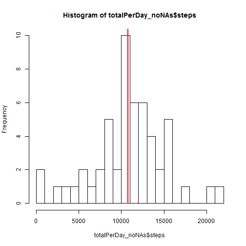
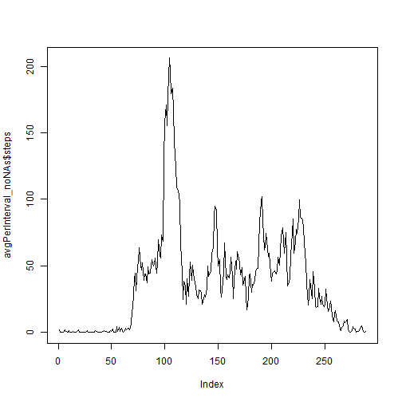
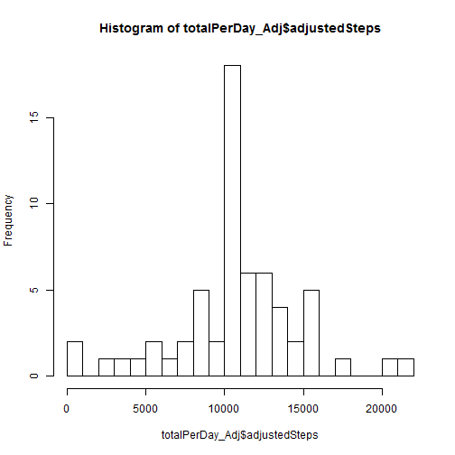
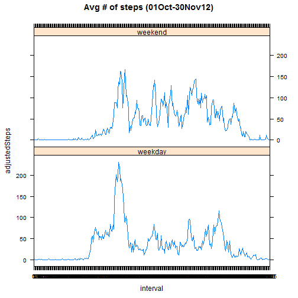

## Part 1 - Loading and preprocessing the data

Task: Load the data (i.e. read.csv());  Process/transform the data (if necessary) into a format suitable for your analysis


```r
activityFile <- download.file("http://d396qusza40orc.cloudfront.net/repdata%2Fdata%2Factivity.zip", "activity.zip")
activity <- unzip("activity.zip")
activity <- read.csv(activity, as.is = TRUE)
```


As a next step before I start doing anything, i would like to get a sense of what the data looks like: 


```r
str (activity)
```

```
## 'data.frame':	17568 obs. of  3 variables:
##  $ steps   : int  NA NA NA NA NA NA NA NA NA NA ...
##  $ date    : chr  "2012-10-01" "2012-10-01" "2012-10-01" "2012-10-01" ...
##  $ interval: int  0 5 10 15 20 25 30 35 40 45 ...
```

```r
summary (activity)
```

```
##      steps            date              interval     
##  Min.   :  0.00   Length:17568       Min.   :   0.0  
##  1st Qu.:  0.00   Class :character   1st Qu.: 588.8  
##  Median :  0.00   Mode  :character   Median :1177.5  
##  Mean   : 37.38                      Mean   :1177.5  
##  3rd Qu.: 12.00                      3rd Qu.:1766.2  
##  Max.   :806.00                      Max.   :2355.0  
##  NA's   :2304
```

```r
head (activity, 15)
```

```
##    steps       date interval
## 1     NA 2012-10-01        0
## 2     NA 2012-10-01        5
## 3     NA 2012-10-01       10
## 4     NA 2012-10-01       15
## 5     NA 2012-10-01       20
## 6     NA 2012-10-01       25
## 7     NA 2012-10-01       30
## 8     NA 2012-10-01       35
## 9     NA 2012-10-01       40
## 10    NA 2012-10-01       45
## 11    NA 2012-10-01       50
## 12    NA 2012-10-01       55
## 13    NA 2012-10-01      100
## 14    NA 2012-10-01      105
## 15    NA 2012-10-01      110
```

```r
tail (activity, 15)
```

```
##       steps       date interval
## 17554    NA 2012-11-30     2245
## 17555    NA 2012-11-30     2250
## 17556    NA 2012-11-30     2255
## 17557    NA 2012-11-30     2300
## 17558    NA 2012-11-30     2305
## 17559    NA 2012-11-30     2310
## 17560    NA 2012-11-30     2315
## 17561    NA 2012-11-30     2320
## 17562    NA 2012-11-30     2325
## 17563    NA 2012-11-30     2330
## 17564    NA 2012-11-30     2335
## 17565    NA 2012-11-30     2340
## 17566    NA 2012-11-30     2345
## 17567    NA 2012-11-30     2350
## 17568    NA 2012-11-30     2355
```

Got it!

The fields were originally described as 
- steps: Number of steps taking in a 5-minute interval (missing values are coded as NA)
- date: The date on which the measurement was taken in YYYY-MM-DD format
- interval: Identifier for the 5-minute interval in which measurement was taken

Now, that we loaded them though .. Let's convert date to a date and interval to a factor


```r
activity$date <- as.Date(activity$date, format = "%Y-%m-%d")
activity$interval <- factor(activity$interval)
str (activity)
```

```
## 'data.frame':	17568 obs. of  3 variables:
##  $ steps   : int  NA NA NA NA NA NA NA NA NA NA ...
##  $ date    : Date, format: "2012-10-01" "2012-10-01" ...
##  $ interval: Factor w/ 288 levels "0","5","10","15",..: 1 2 3 4 5 6 7 8 9 10 ...
```

```r
summary (activity)
```

```
##      steps             date               interval    
##  Min.   :  0.00   Min.   :2012-10-01   0      :   61  
##  1st Qu.:  0.00   1st Qu.:2012-10-16   5      :   61  
##  Median :  0.00   Median :2012-10-31   10     :   61  
##  Mean   : 37.38   Mean   :2012-10-31   15     :   61  
##  3rd Qu.: 12.00   3rd Qu.:2012-11-15   20     :   61  
##  Max.   :806.00   Max.   :2012-11-30   25     :   61  
##  NA's   :2304                          (Other):17202
```


## Part 2 - What is mean total number of steps taken per day?

For this part of the assignment, you can ignore the missing values in the dataset.

For that purpose we create a subset of the non-NA activities and we will use it in this section 


```r
activity_noNAs <-subset(activity, activity$steps!="NA")
```

Calculate the total number of steps taken per day


```r
totalPerDay_noNAs <- aggregate (steps ~ date, data=activity_noNAs, sum)
print (totalPerDay_noNAs)
```

```
##          date steps
## 1  2012-10-02   126
## 2  2012-10-03 11352
## 3  2012-10-04 12116
## 4  2012-10-05 13294
## 5  2012-10-06 15420
## 6  2012-10-07 11015
## 7  2012-10-09 12811
## 8  2012-10-10  9900
## 9  2012-10-11 10304
## 10 2012-10-12 17382
## 11 2012-10-13 12426
## 12 2012-10-14 15098
## 13 2012-10-15 10139
## 14 2012-10-16 15084
## 15 2012-10-17 13452
## 16 2012-10-18 10056
## 17 2012-10-19 11829
## 18 2012-10-20 10395
## 19 2012-10-21  8821
## 20 2012-10-22 13460
## 21 2012-10-23  8918
## 22 2012-10-24  8355
## 23 2012-10-25  2492
## 24 2012-10-26  6778
## 25 2012-10-27 10119
## 26 2012-10-28 11458
## 27 2012-10-29  5018
## 28 2012-10-30  9819
## 29 2012-10-31 15414
## 30 2012-11-02 10600
## 31 2012-11-03 10571
## 32 2012-11-05 10439
## 33 2012-11-06  8334
## 34 2012-11-07 12883
## 35 2012-11-08  3219
## 36 2012-11-11 12608
## 37 2012-11-12 10765
## 38 2012-11-13  7336
## 39 2012-11-15    41
## 40 2012-11-16  5441
## 41 2012-11-17 14339
## 42 2012-11-18 15110
## 43 2012-11-19  8841
## 44 2012-11-20  4472
## 45 2012-11-21 12787
## 46 2012-11-22 20427
## 47 2012-11-23 21194
## 48 2012-11-24 14478
## 49 2012-11-25 11834
## 50 2012-11-26 11162
## 51 2012-11-27 13646
## 52 2012-11-28 10183
## 53 2012-11-29  7047
```


If you do not understand the difference between a histogram and a barplot, research the difference between them. Make a histogram of the total number of steps taken each day


```r
library ("ggplot2")
hist (totalPerDay_noNAs$steps, breaks = round(nrow (totalPerDay_noNAs)/3,0))
lines( c(mean(totalPerDay_noNAs$steps),mean(totalPerDay_noNAs$steps)), c(0,max(totalPerDay_noNAs$steps)), col = "red", lwd = 2)
```

 

Calculate and report the mean and median of the total number of steps taken per day


```r
mean (totalPerDay_noNAs$steps)
```

```
## [1] 10766.19
```

```r
median (totalPerDay_noNAs$steps)
```

```
## [1] 10765
```


## Part 3 -- What is the average daily activity pattern?

Make a time series plot (i.e. type = "l") of the 5-minute interval (x-axis) and the average number of steps taken, averaged across all days (y-axis)


```r
avgPerInterval_noNAs <- aggregate (steps ~ interval, data=activity_noNAs, mean)
plot (avgPerInterval_noNAs$steps, type = "l")
```

 

Which 5-minute interval, on average across all the days in the dataset, contains the maximum number of steps?


```r
subset (avgPerInterval_noNAs, avgPerInterval_noNAs$steps == max(avgPerInterval_noNAs$steps))
```

```
##     interval    steps
## 104      835 206.1698
```

```r
## note: there could be more than one... 
```
# Part 4 -- Inputing missing values

Note that there are a number of days/intervals where there are missing values (coded as NA). The presence of missing days may introduce bias into some calculations or summaries of the data.

Calculate and report the total number of missing values in the dataset (i.e. the total number of rows with NAs)

Note: We already have the answer from the exploratory function we ran earlier (see summary) but in case we want to embed the exact number will be ..


```r
nrow (subset(activity, is.na(activity$steps)==TRUE))
```

```
## [1] 2304
```

Devise a strategy for filling in all of the missing values in the dataset. The strategy does not need to be sophisticated. For example, you could use the mean/median for that day, or the mean for that 5-minute interval, etc.

The approach I decided on is to use the mean for that 5 min interval (excluding all unknown values). Note: this approach will only work if there is at least one non-NA value for each interval. (We will otherwise have to define a rule of what happens if there all NAs in the respecitve period)

So we check .. 
Given that when we sum or mean up an NA and a value - the result is NA


```r
temp <- aggregate(steps ~ interval, data = activity, sum) 
nrow (temp$steps[is.na (temp$steps)==TRUE])
```

```
## NULL
```

```r
rm (temp)
```
NULL -- Nothing to worry about.. we may proceed with filling in the NA data with mean for the interval 

Create a new dataset that is equal to the original dataset but with the missing data filled in.


```r
temp<-as.data.frame(cbind(
          is.na(activity$steps)*avgPerInterval_noNAs$steps,
          (!(is.na(activity$steps)))*activity$steps))
          
# two columns -- one will only have the mean value if the original value was NA and the second one will only have a value of the actual steps if the original value is not NA

temp[is.na(temp)] <- 0
#replace all NAs with zeroes
temp <- temp [,1]+temp [,2]
# now sum them up..        
activity$adjustedSteps<-temp
# append that new value to our activity dataframe under adjustedSteps column
rm (temp)
```

Make a histogram of the total number of steps taken each day and calculate and report the mean and median total number of steps taken per day. Do these values differ from the estimates from the first part of the assignment? What is the impact of imputing missing data on the estimates of the total daily number of steps?


```r
totalPerDay_Adj <- aggregate (adjustedSteps ~ date, data=activity, sum)

cat ("Mean\n",
      "After Adjustment:", mean (totalPerDay_Adj$adjustedSteps),"\n",
      "Before Adjustment:", mean (totalPerDay_noNAs$steps))
```

```
## Mean
##  After Adjustment: 10766.19 
##  Before Adjustment: 10766.19
```

```r
cat ("Median\n",
      "After Adjustment:", median (totalPerDay_Adj$adjustedSteps),"\n",
      "Before Adjustment:", median (totalPerDay_noNAs$steps))
```

```
## Median
##  After Adjustment: 10766.19 
##  Before Adjustment: 10765
```

```r
hist (totalPerDay_Adj$adjustedSteps, breaks = round(nrow (totalPerDay_Adj)/3,0))
```

 

The mean is expected to stay the same (we did fill in the values with mean values).
The median shifted slightly, almost ignorable. 

## Part 5 - Are there differences in activity patterns between weekdays and weekends?

Create a new factor variable in the dataset with two levels - "weekday" and "weekend" indicating whether a given date is a weekday or weekend day.

For this part the weekdays() function may be of some help here. Use the dataset with the filled-in missing values for this part.


```r
library(plyr)

activity$isWeekend <- mapvalues(as.factor(as.numeric(grepl("Sat|Sun", weekdays(as.Date(activity$date),abbreviate=TRUE)))), from = c(0, 1), to = c("weekday", "weekend"))
```

Make a panel plot containing a time series plot (i.e. type = "l") of the 5-minute interval (x-axis) and the average number of steps taken, averaged across all weekday days or weekend days (y-axis). See the README file in the GitHub repository to see an example of what this plot should look like using simulated data.


```r
avgPerIntervalandDayType<- aggregate (adjustedSteps ~ interval + isWeekend, data = activity, mean)
        
library (lattice)
xyplot (adjustedSteps ~ interval|factor(isWeekend), 
        data = avgPerIntervalandDayType,
        layout = c (1,2), type ="l",
        main=list(label="Avg # of steps (01Oct-30Nov12)"))
```

 
